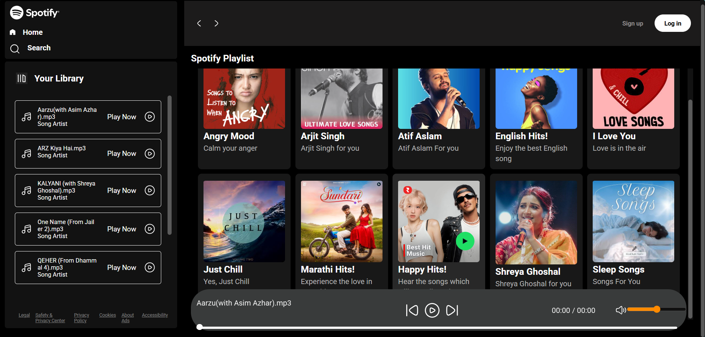

# 🎵 Spotify Clone

A responsive Spotify Clone built using **HTML, CSS, and JavaScript** that replicates the core look and feel of Spotify. The application allows users to browse albums and play songs from a structured music library.

---

## 🚀 Features

- 🎵 Play and pause songs
- ⏮️ Previous and Next controls
- 📂 Album-based song organization
- 🎚️ Interactive music player
- 📱 Responsive user interface
- 🎨 Spotify-inspired design
- ⚡ Fast and lightweight

---

## 🛠️ Technologies Used

- HTML5
- CSS3
- JavaScript (ES6)

---

## 📁 Project Structure

```
Spotify Clone/
│
├── CSS/
│   ├── style.css
│   └── utility.css
│
├── images/
│
├── songs/
│   ├── Album1/
│   │   ├── cover.jpg
│   │   └── info.json
│   ├── Album2/
│   │   ├── cover.jpg
│   │   └── info.json
│   └── ...
│
├── index.html
├── script.js
├── favicon.ico
└── README.md
```

---

## ⚙️ Installation

1. Clone the repository

```bash
git clone https://github.com/Sanket11112005/Spotify-clone.git
```

2. Open the project folder.

3. Open `index.html` in your browser.

---

## 🎵 Audio Files

The repository **does not include `.mp3` files**.

Only the folder structure, album covers, and `info.json` files are included.

To run the project with music:

- Add your own `.mp3` files inside the appropriate album folders.
- Keep the existing folder structure unchanged.

---

## 📸 Screenshots

Add screenshots here after capturing them.

Example:

```
screenshots/
    home.png
    player.png
```

Then include them like this:

```markdown


---

## 👨‍💻 Author

**Sanket Bagale**

GitHub: https://github.com/Sanket11112005

---

## ⭐ Support

If you found this project useful, consider giving it a ⭐ on GitHub.